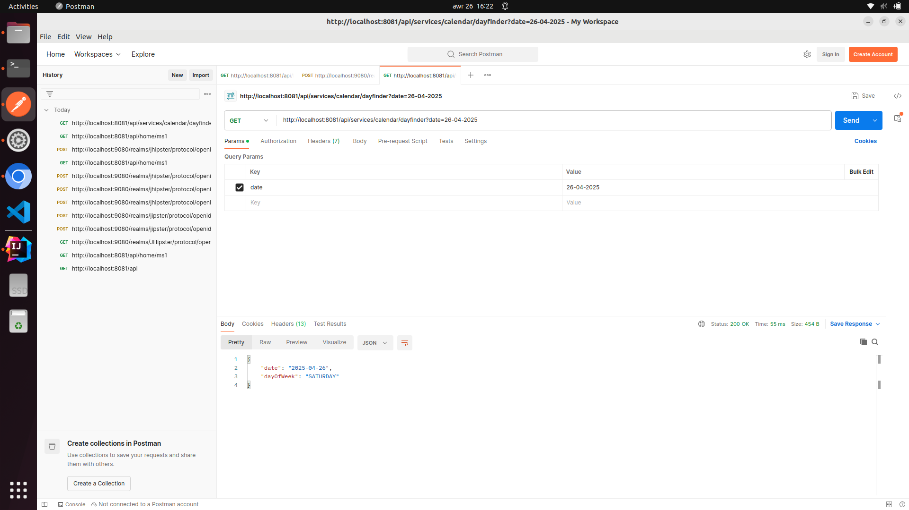
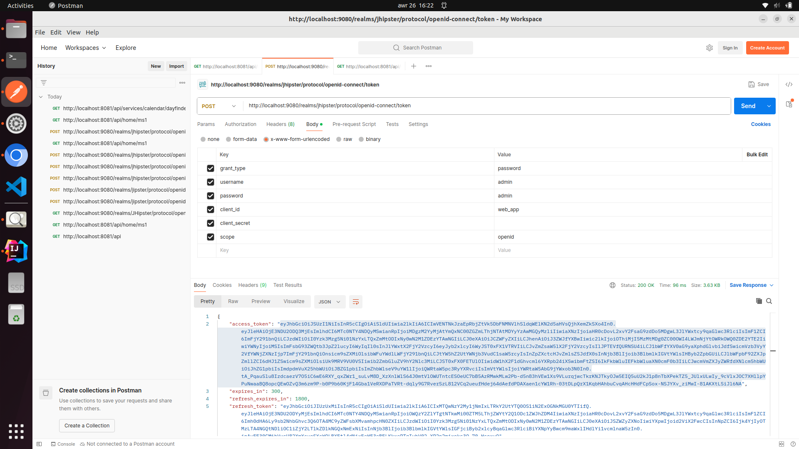
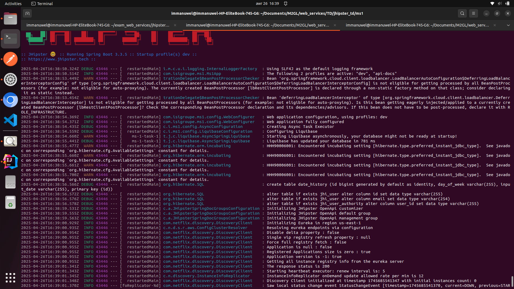
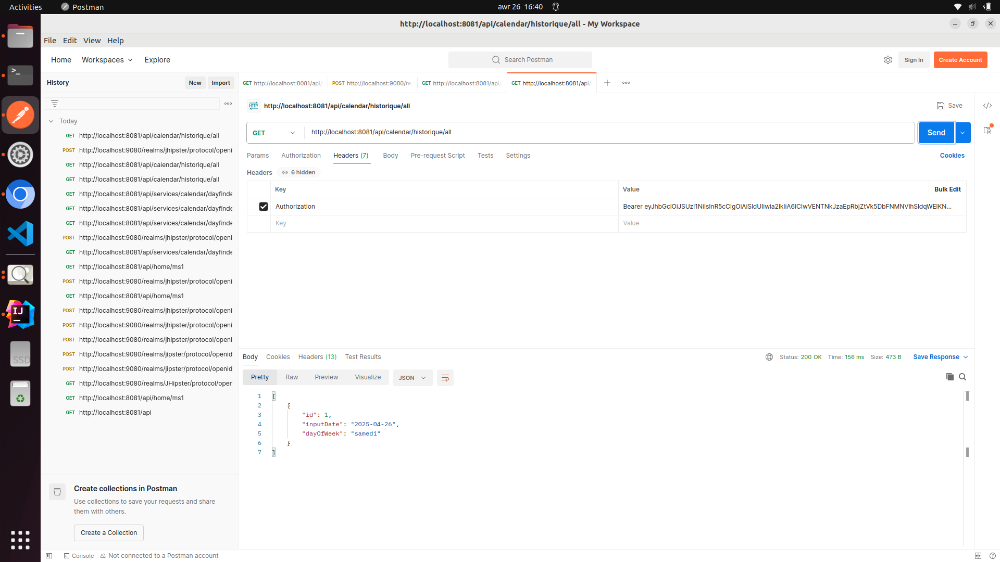
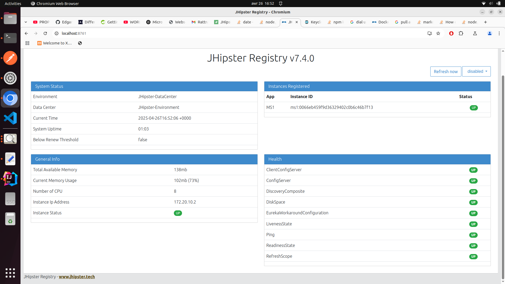
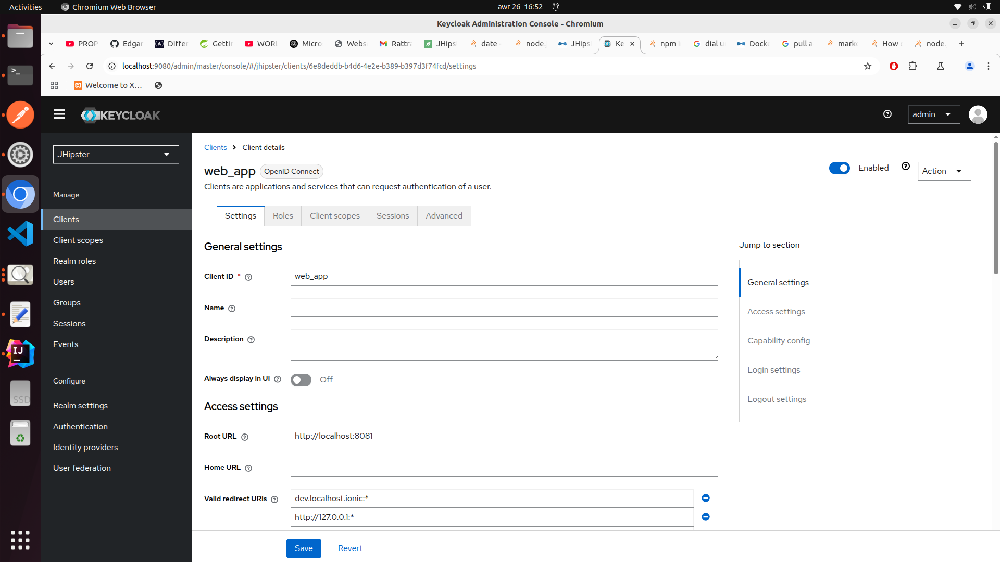

# NOM : AWORET EMMANUEL

# STEPS ( Ubuntu )

1. Run Clone the registry ( link here )
2. Run the keycloack : sudo docker-compose -f src/main/docker/keycloak.yml up
3. Run the project : ./mvnw

# CALENDAR FINDER

